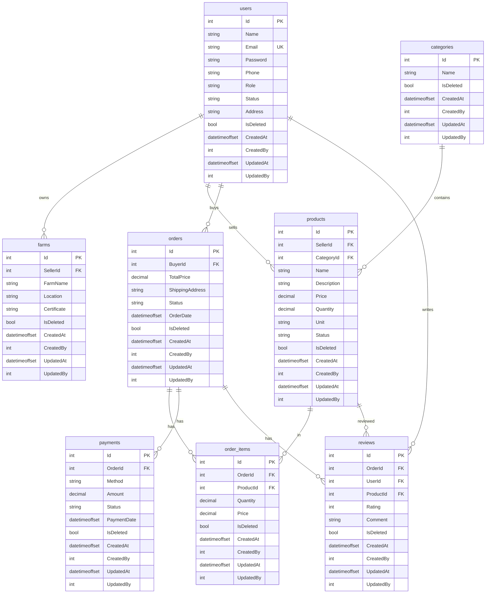

# Database Schema

Database: **PostgreSQL** — Database name: `VAMDb`

## Entity Relationship Diagram



## Bảng chi tiết

### BaseEntity (abstract)

Tất cả entities kế thừa từ `BaseEntity`:

| Column | Type | Description |
|---|---|---|
| IsDeleted | bool | Soft delete flag (default: `false`) |
| CreatedAt | DateTimeOffset | Thời gian tạo (UTC) |
| CreatedBy | int? | ID người tạo |
| UpdatedAt | DateTimeOffset | Thời gian cập nhật (UTC) |
| UpdatedBy | int? | ID người cập nhật |

### users

| Column | Type | Constraints | Description |
|---|---|---|---|
| Id | int | PK, Identity | |
| Name | string(255) | Required | Tên người dùng |
| Email | string(255) | Required, Unique | Email đăng nhập |
| Password | string(255) | Required | Mật khẩu (hash) |
| Phone | string(20) | Nullable | Số điện thoại |
| Role | string(20) | Required | Vai trò: buyer / seller / admin |
| Status | string(20) | Default: "active" | Trạng thái tài khoản |
| Address | string | Nullable | Địa chỉ |

### categories

| Column | Type | Constraints | Description |
|---|---|---|---|
| Id | int | PK, Identity | |
| Name | string(100) | Required | Tên danh mục |

### farms

| Column | Type | Constraints | Description |
|---|---|---|---|
| Id | int | PK, Identity | |
| SellerId | int | FK → users.Id | Chủ trang trại |
| FarmName | string(255) | Required | Tên trang trại |
| Location | string | Required | Vị trí |
| Certificate | string(255) | Nullable | Chứng nhận (VietGAP, organic, ...) |

### products

| Column | Type | Constraints | Description |
|---|---|---|---|
| Id | int | PK, Identity | |
| SellerId | int | FK → users.Id | Người bán |
| CategoryId | int | FK → categories.Id | Danh mục |
| Name | string(255) | Required | Tên sản phẩm |
| Description | string | Nullable | Mô tả chi tiết |
| Price | decimal(15,2) | Required | Giá |
| Quantity | decimal(10,2) | Required | Số lượng tồn kho |
| Unit | string(50) | Required | Đơn vị: kg, con, bó, ... |
| Status | string(20) | Default: "pending" | Trạng thái: pending / approved / rejected |

### orders

| Column | Type | Constraints | Description |
|---|---|---|---|
| Id | int | PK, Identity | |
| BuyerId | int | FK → users.Id | Người mua |
| TotalPrice | decimal(15,2) | Required | Tổng giá trị đơn hàng |
| ShippingAddress | string | Required | Địa chỉ giao hàng |
| Status | string(20) | Default: "pending" | Trạng thái: pending / confirmed / shipped / delivered / cancelled |
| OrderDate | DateTimeOffset | Required | Ngày đặt hàng |

### order_items

| Column | Type | Constraints | Description |
|---|---|---|---|
| Id | int | PK, Identity | |
| OrderId | int | FK → orders.Id | Đơn hàng |
| ProductId | int | FK → products.Id | Sản phẩm |
| Quantity | decimal(10,2) | Required | Số lượng |
| Price | decimal(15,2) | Required | Giá tại thời điểm mua |

### payments

| Column | Type | Constraints | Description |
|---|---|---|---|
| Id | int | PK, Identity | |
| OrderId | int | FK → orders.Id | Đơn hàng |
| Method | string(50) | Required | Phương thức: PayOS / COD / bank_transfer |
| Amount | decimal(15,2) | Required | Số tiền |
| Status | string(20) | Default: "pending" | Trạng thái: pending / completed / failed / refunded |
| PaymentDate | DateTimeOffset | Required | Ngày thanh toán |

### reviews

| Column | Type | Constraints | Description |
|---|---|---|---|
| Id | int | PK, Identity | |
| OrderId | int | FK → orders.Id | Đơn hàng |
| UserId | int | FK → users.Id | Người đánh giá |
| ProductId | int | FK → products.Id | Sản phẩm |
| Rating | int | Required, Range(1-5) | Điểm đánh giá |
| Comment | string | Nullable | Bình luận |

## Global Query Filters

Tất cả entities đều có **Global Query Filter** tự động lọc bản ghi đã xóa mềm:

```csharp
modelBuilder.Entity<User>().HasQueryFilter(e => !e.IsDeleted);
// Áp dụng cho tất cả 8 entities
```

## Indexes

| Bảng | Column | Loại |
|---|---|---|
| users | Email | Unique |
